# egui-desktop

A comprehensive desktop UI framework for egui applications with native-like window decorations, advanced theming, and cross-platform desktop integration.

## 📸 Screenshots

### Windows

<div align="center">
  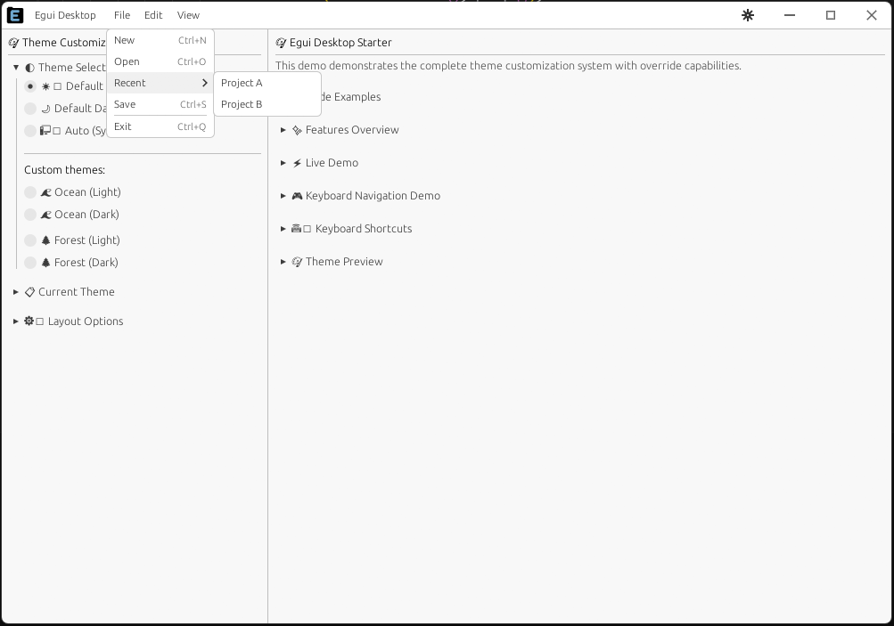
  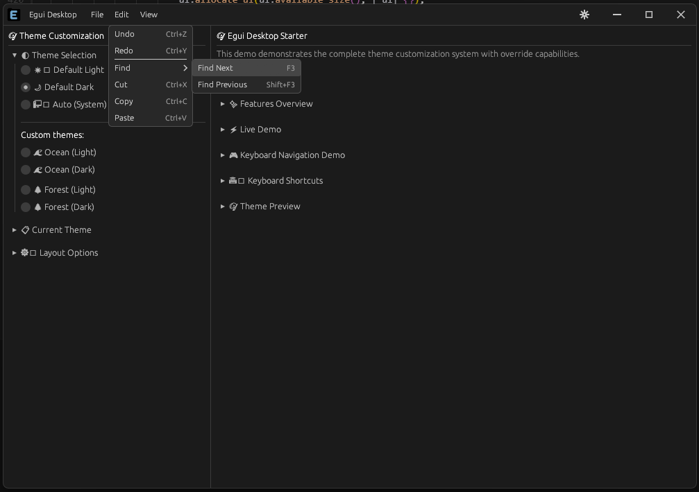
  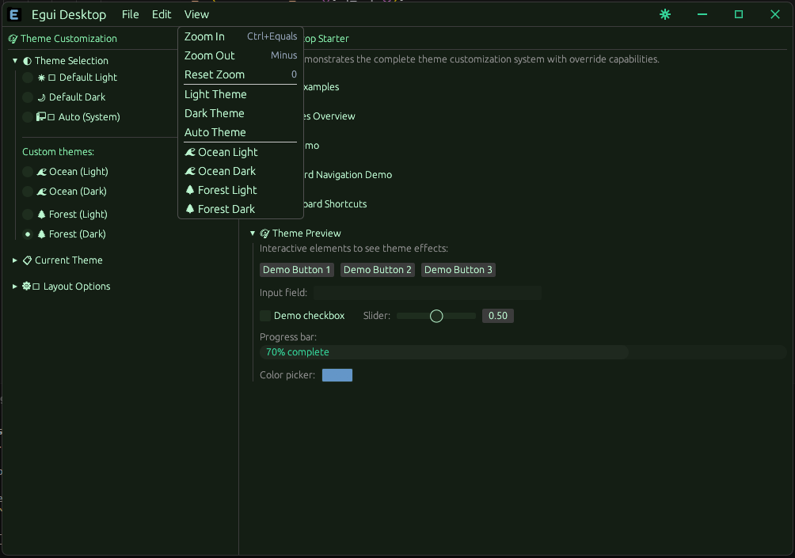
  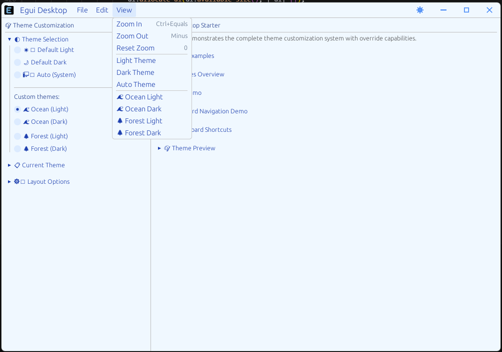
</div>

### macOS

<div align="center">
  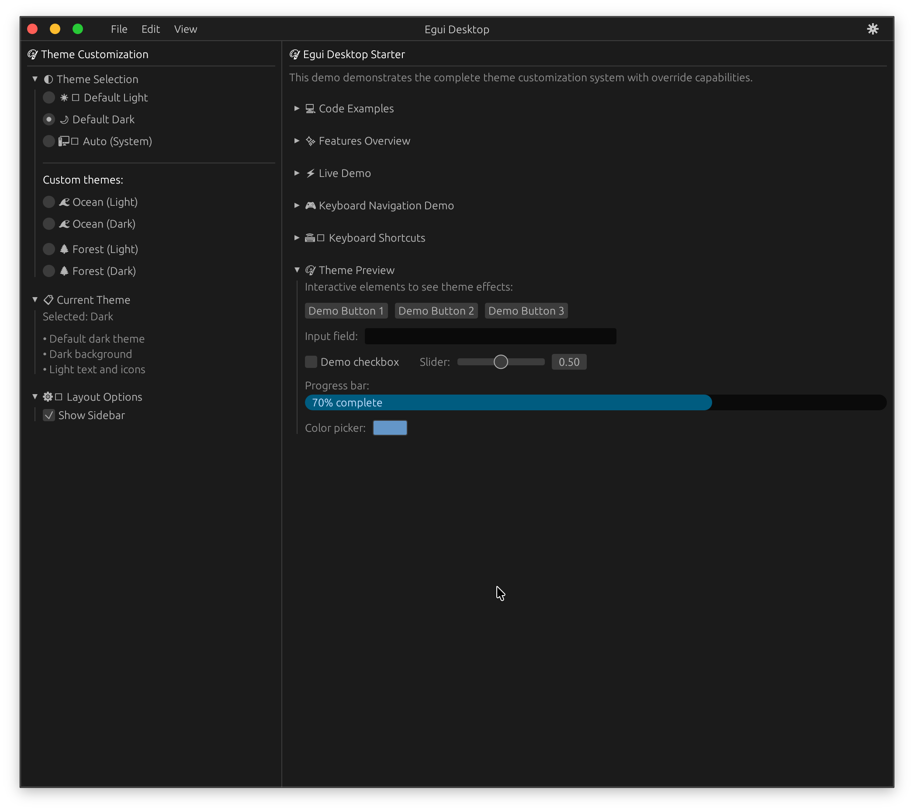
  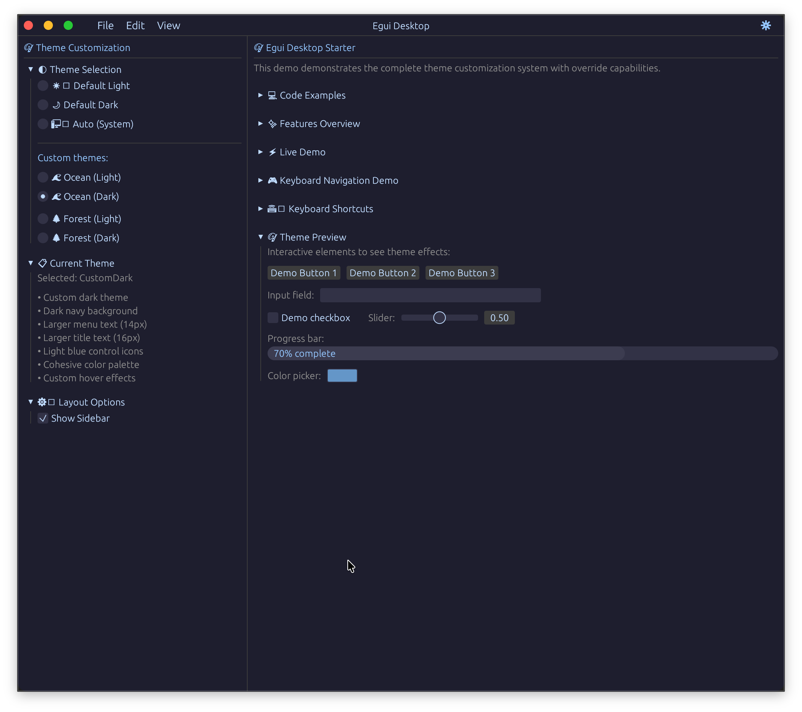
  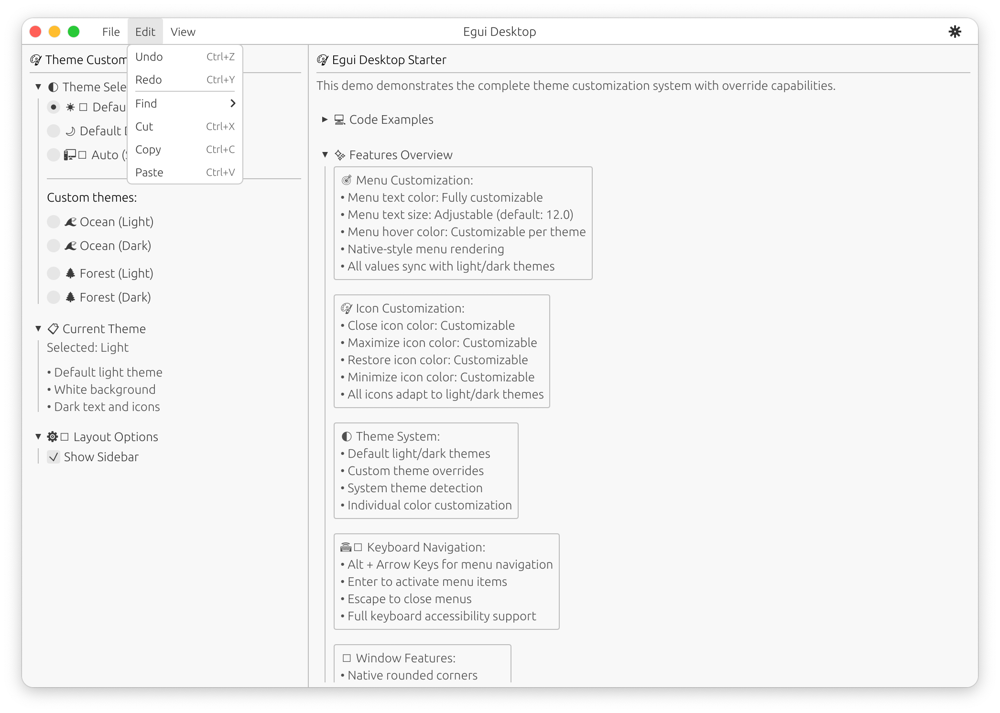
  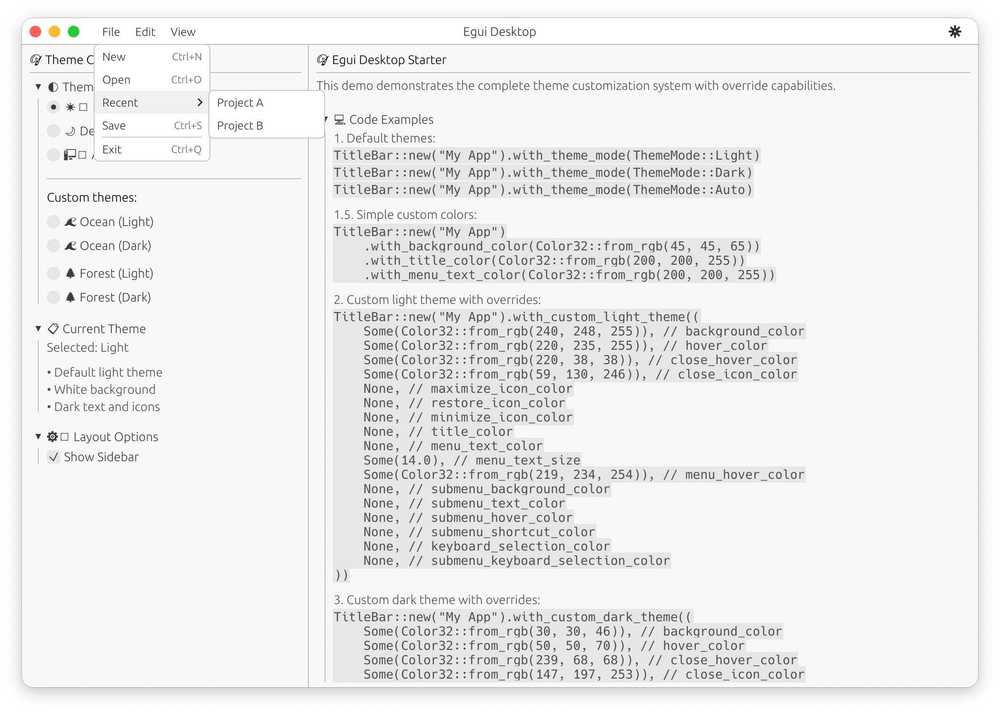
</div>

### Responsive menu bar

<div align="center">
  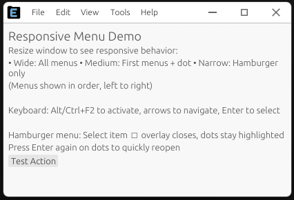
  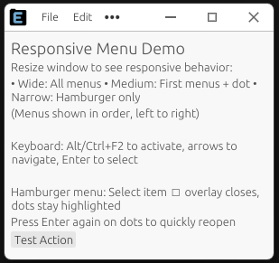
  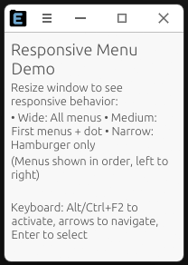
</div>

## Projects using this crate

If you want your project to be added there, just ask!

- [Logline](https://github.com/zibo-chen/logline) : High-Performance Log Viewer with AI-Powered Analysis via MCP.

## ⚠️ Disclaimer

**This project is currently in alpha version and under active development.** It may not be fully tested on all platforms. While we strive for cross-platform compatibility, some features may behave differently or have limitations on certain operating systems. Please test thoroughly in your target environments before using in production applications.

**Known limitations:**

- System theme detection may not work on all Linux distributions
- Native rounded corners support varies by platform and window manager
- Linux: Rounded corners are currently not supported
- Some advanced features may require specific OS versions or configurations

We welcome feedback, bug reports, and contributions to help improve platform compatibility! Feel free to open pull requests or report issues - your input helps make this framework better for everyone.

## 🎯 Goal

As a developer who uses this framework to build my own desktop applications, I'm passionate about rust and egui and want to make desktop development easier for Rust programmers. This framework addresses common pain points when building native-feeling desktop apps with egui and custom title bars:

- **Native integration**: Seamless window decorations and platform-specific behaviors
- **Developer experience**: Simple APIs that handle complex cross-platform differences
- **Customization**: Flexible theming and styling options for modern applications

Not WebAssembly-oriented, but designed to give egui desktop apps professional look and features (custom title bar, menus, system icons, Windows/macOS/Linux themes).

NB: The main objective is to fully master the title bar and intelligently utilize the available space. This modern and open approach is perfectly suited for creating a visual identity or brand. However, at the moment, it's not as flexible as an application using React and CSS, so some aspects of the crate remain subjective, and there's certainly still much to be done to ensure everyone finds it useful (you're welcome to contribute). The menu system follows a responsive design similar to VS Code: items that fit appear in the bar, the rest go into an overflow dropdown (dots or hamburger), with full keyboard navigation and recursive submenus to any depth.

That being said, the framework is already capable of providing a solid foundation so you can focus on building your application's logic rather than struggling with platform-specific user interface details.

## ✨ Features

### 🪟 **Title Bars**

- **macOS**: Custom title bar with authentic traffic light buttons (close, minimize, maximize)
- **Windows/Linux**: Generic title bar with standard window controls
  - _Note: Linux currently uses same title bar style as Windows. Contributions are welcome to add Linux-specific styling!_
- **Auto-detection**: Automatically selects appropriate title bar for your OS
- **Custom app icons**: Support for SVG, PNG, JPEG and other image formats
- **Custom title bar icons**: Add your own icons with automatic platform positioning
- **Icon keyboard shortcuts**: Bind keyboard shortcuts to custom icons with tooltip display
- **Optional titles**: Hide title text while keeping icon and controls
- **Menu integration**: Add menu items or icons directly in title bar
- **Responsive menu bar**: Items adapt to available width; overflow items move to a "…" (dots) or hamburger dropdown, similar to VS Code; the hamburger icon is available in **static** (3 lines) or **animated** (bars ↔ dots) style
- **Recursive submenus**: Multi-level menus with submenus and cascading sidemenus to arbitrary depth (state, navigation, and rendering are fully recursive)
- **Keyboard navigation**: Full keyboard support (Alt / Ctrl+F2, arrows, Enter, Escape) in the bar, overflow overlay, and all submenu levels
- **Mouse/keyboard sync**: Any mouse action updates keyboard state so the next keypress matches what is on screen
- **Cross-platform shortcuts**: Comprehensive keyboard shortcut system with global state management
- **Native control replacement**: All window control buttons (minimize, maximize, close) are replaced with custom egui-drawn buttons for complete visual control

### 🎨 **Theme System**

- **Light/Dark themes**: Built-in light and dark themes with proper contrast
- **System theme detection**: Automatically follows your OS theme (Windows, macOS, Linux)
- **Custom themes**: Create your own color schemes
- **Theme synchronization**: Sync with egui's theme system
- **Cross-platform detection**: Detects system dark mode on all major platforms

### 🪟 **Window Features**

- **Native rounded corners**: Platform-specific rounded window corners
- **Manual resizing**: Interactive resize handles for custom window resizing
- **Decorative windows**: Disable native decorations for full customization
- **Cross-platform**: Works on Windows, macOS, and Linux

### 🎛️ **Customization**

- **Colors**: Customize background, hover, close button, and title colors
- **Fonts**: Adjustable title font size
- **Icons**: Custom app icons and window control icons
- **Layouts**: Flexible menu layouts and spacing
- **Behaviors**: Customizable button behaviors and interactions

## 🚀 Quick Start

### CLI Tool

The easiest way to get started is using our CLI tool that generates a complete starter project:

#### Installation

```bash
# Install CLI globally from crates.io
cargo install egui-desktop-cli

# Or install from local development:
# cargo install --path cli
```

#### Usage

```bash
# Generate a new project
egui-desktop my-super-project

# This creates a complete project with:
# - Modular structure (main.rs, app.rs, theme_provider.rs, etc.)
# - All dependencies configured
# - Ready-to-run example with themes, sidebar, and custom UI
```

The CLI generates a professional project structure with:

- ✅ **Modular architecture**: Clean separation of concerns
- ✅ **Complete setup**: All dependencies and imports configured
- ✅ **Working example**: Interactive theme demo with sidebar
- ✅ **Cross-platform**: Works on Windows, macOS, and Linux

For more details about the CLI and generated project structure, see the [CLI README](cli/README.md).

### Basic Usage

```rust
use egui_desktop::{TitleBar, apply_rounded_corners, render_resize_handles};

impl eframe::App for MyApp {
    fn update(&mut self, ctx: &egui::Context, frame: &mut eframe::Frame) {
        // Apply native rounded corners (call once)
        apply_rounded_corners(frame);

        // Render title bar with default light theme
        TitleBar::new("My App").show(ctx);

        // Add manual resize handles
        render_resize_handles(ctx);

        // Your app content here
        egui::CentralPanel::default().show(ctx, |ui| {
            ui.heading("Hello World!");
        });
    }
}
```

### Native Control Replacement

The framework completely replaces native window control buttons with custom egui-drawn buttons:

- **Complete visual control**: All buttons (minimize, maximize, close) are drawn using egui
- **Custom styling**: Full control over button appearance, colors, hover effects, and animations
- **Platform consistency**: Buttons look identical across Windows, macOS, and Linux
- **Theme integration**: Buttons automatically adapt to your custom themes
- **No native dependencies**: No reliance on platform-specific button rendering

```rust
// Custom control button colors
let title_bar = TitleBar::new("My App")
    .with_custom_theme(TitleBarTheme {
        close_hover_color: egui::Color32::RED,           // Red close button on hover
        minimize_icon_color: egui::Color32::BLUE,        // Blue minimize icon
        maximize_icon_color: egui::Color32::GREEN,       // Green maximize icon
        restore_icon_color: egui::Color32::YELLOW,       // Yellow restore icon
        ..Default::default()
    });
```

### Theme Customization

```rust
use egui_desktop::{TitleBar, ThemeMode, TitleBarTheme};

// Light theme
TitleBar::new("My App")
    .with_theme_mode(ThemeMode::Light)
    .show(ctx);

// Dark theme
TitleBar::new("My App")
    .with_theme_mode(ThemeMode::Dark)
    .show(ctx);

// System theme (follows OS)
TitleBar::new("My App")
    .with_theme_mode(ThemeMode::System)
    .sync_with_system_theme()
    .show(ctx);

// Custom theme
TitleBar::new("My App")
    .with_theme(TitleBarTheme {
        background_color: Color32::from_rgb(45, 45, 65),
        hover_color: Color32::from_rgb(65, 65, 85),
        close_hover_color: Color32::from_rgb(220, 20, 40),
        close_icon_color: Color32::from_rgb(180, 180, 180),
        maximize_icon_color: Color32::from_rgb(180, 180, 180),
        restore_icon_color: Color32::from_rgb(180, 180, 180),
        minimize_icon_color: Color32::from_rgb(180, 180, 180),
        title_color: Color32::from_rgb(220, 220, 220),
        menu_text_color: Color32::from_rgb(220, 220, 220),
        menu_text_size: 14.0,
        menu_hover_color: Color32::from_rgb(80, 80, 100),
        keyboard_selection_color: Color32::from_rgb(0, 120, 215),
        submenu_background_color: Color32::from_rgb(50, 50, 70),
        submenu_text_color: Color32::from_rgb(220, 220, 220),
        submenu_text_size: 14.0,
        submenu_hover_color: Color32::from_rgb(80, 80, 100),
        submenu_disabled_color: Color32::from_rgb(120, 120, 120),
        submenu_shortcut_color: Color32::from_rgb(150, 150, 150),
        submenu_border_color: Color32::from_rgb(200, 200, 200),
        submenu_keyboard_selection_color: Color32::from_rgb(0, 120, 215),
    })
    .show(ctx);
```

```rust
use egui_desktop::{TitleBar, CustomIcon, KeyboardShortcut};

TitleBar::new("My App")
    // Custom app icon (supports SVG, PNG, JPEG, etc.)
    .with_custom_app_icon(include_bytes!("icon.svg"), "app-icon.svg")

    // Add custom icon with callback and tooltip
    .add_icon(
        CustomIcon::Image(ImageSource::from_bytes("settings.svg", include_bytes!("settings.svg"))),
        Some(Box::new(|| println!("Settings clicked!"))),
        Some("Settings".to_string()),
        None // No keyboard shortcut
    )

    // Add custom icon with keyboard shortcut
    .add_icon(
        CustomIcon::Drawn(Box::new(|painter, rect, color| {
            // Custom drawing code for notification bell
            painter.circle_filled(rect.center(), rect.width() * 0.4, color);
        })),
        Some(Box::new(|| println!("Notifications clicked!"))),
        Some("Notifications".to_string()),
        Some(KeyboardShortcut::parse("ctrl+n")) // Ctrl+N shortcut
    )

    .show(ctx);

// Don't forget to handle shortcuts in your app's update loop
impl eframe::App for MyApp {
    fn update(&mut self, ctx: &egui::Context, _frame: &mut eframe::Frame) {
        self.title_bar.handle_icon_shortcuts(ctx);
        // ... rest of your app logic
    }
}
```

#### Icon Types

- **Image Icons**: Use `CustomIcon::Image()` with SVG, PNG, JPEG, etc.
- **Drawn Icons**: Use `CustomIcon::Drawn()` with custom drawing functions
- **Animated Icons**: Use `CustomIcon::Animated()` with frame-based animations

#### Keyboard Shortcuts

Icons can have keyboard shortcuts that trigger their callbacks:

- Shortcuts are displayed in tooltips: "Settings (Ctrl+,)"
- Use `KeyboardShortcut::parse()` for simple string-based shortcuts
- Call `handle_icon_shortcuts(ctx)` in your app's update loop

#### Platform-specific positioning

- **Windows/Linux**: Icons appear to left of window control buttons
- **macOS**: Icons appear to right of traffic light buttons

#### Animated Icons

You can add animated icons that framework will drive every frame with timing, hover/press state, and theme colors.

API overview:

- `CustomIcon::Animated(Box<dyn Fn(&Painter, Rect, Color32, &mut IconAnimationState, AnimationCtx) + Send + Sync>)`
- `CustomIcon::AnimatedUi(Box<dyn Fn(&mut Ui, Rect, Color32, &mut IconAnimationState, AnimationCtx) + Send + Sync>)`
- `TitleBar::add_animated_icon(...)` and `TitleBar::add_animated_ui_icon(...)`
- `IconAnimationState { hover_t, press_t, progress, last_time }`
- `AnimationCtx { time, delta_seconds, hovered, pressed }`

Notes:

- Make your `TitleBar` persistent (store it in your app struct) so per-icon animation state is preserved across frames.
- Clicks automatically request a repaint, so animations start immediately.
- Theme colors are passed as `icon_color`; hover backgrounds use title bar theme. Theme changes update these automatically.
- You can override an icon color with `set_custom_icon_color(index, Some(color))`; pass `None` to return to theme-driven color.

Painter-based example (minimal):

```rust
use egui_desktop::{TitleBar, CustomIcon, KeyboardShortcut};

TitleBar::new("My App")
    // Custom app icon (supports SVG, PNG, JPEG, etc.)
    .with_custom_app_icon(include_bytes!("icon.svg"), "app-icon.svg")

    // Add custom icon with callback and tooltip
    .add_icon(
        CustomIcon::Image(ImageSource::from_bytes("settings.svg", include_bytes!("settings.svg"))),
        Some(Box::new(|| println!("Settings clicked!"))),
        Some("Settings".to_string()),
        None // No keyboard shortcut
    )

    // Add custom icon with keyboard shortcut
    .add_icon(
        CustomIcon::Drawn(Box::new(|painter, rect, color| {
            // Custom drawing code for notification bell
            painter.circle_filled(rect.center(), rect.width() * 0.4, color);
        })),
        Some(Box::new(|| println!("Notifications clicked!"))),
        Some("Notifications".to_string()),
        Some(KeyboardShortcut::parse("ctrl+n")) // Ctrl+N shortcut
    )

    .show(ctx);

// Don't forget to handle shortcuts in your app's update loop
impl eframe::App for MyApp {
    fn update(&mut self, ctx: &egui::Context, _frame: &mut eframe::Frame) {
        self.title_bar.handle_icon_shortcuts(ctx);
        // ... rest of your app logic
    }
}
```

Theme-aware coloring:

```rust
title_bar.set_custom_icon_color(0, None); // use theme color
// Or override:
title_bar.set_custom_icon_color(0, Some(egui::Color32::from_rgb(255, 200, 0)));
```

### Menu System

```rust
TitleBar::new("My App")
    .add_menu_item("File", Some(Box::new(|| println!("File clicked"))))
    .add_menu_item("Edit", Some(Box::new(|| println!("Edit clicked"))))
    .add_menu_item("Help", Some(Box::new(|| println!("Help clicked"))))
    .show(ctx);
```

The menu bar is **responsive**: when horizontal space is limited, items that do not fit are grouped behind a "…" (dots) indicator or, in very narrow windows, a **hamburger** icon (static three lines or animated bars↔dots). Clicking or focusing the overflow opens a dropdown with the same items; keyboard navigation (arrows, Enter) works the same there. Submenus can nest to **arbitrary depth** (File → Recent Files → folder → item, etc.); both mouse and keyboard stay in sync.

### Keyboard Navigation & Shortcuts

The framework provides comprehensive keyboard navigation that follows platform standards:

#### Navigation Activation

- **Alt** (Windows/Linux standard)
- **Ctrl+F2** (macOS standard)

#### Navigation Controls

- **Arrow Keys**: Navigate through menu items
  - **Left/Right**: Navigate between top-level menus (or between last bar item and overflow dots)
  - **Up/Down**: Navigate within the current menu or within the overflow dropdown
  - **Right** / **Enter** / **Space**: Open overflow dropdown (when on dots), open submenus, or run action
  - **Left**: Close current submenu or overflow; on first bar item, no wrap to dots

#### Selection

- **Enter**: Select menu item or trigger action
- **Space**: Alternative selection (Qt/macOS/Linux standard)

#### Menu Management

- **Escape**: Close all menus and deactivate keyboard navigation
- **Mouse click outside**: Close menus but keep keyboard navigation active

#### Smart Navigation Logic

The navigation system handles:

1. **Bar + overflow**: When some items are in the bar and some in overflow, Left/Right move between bar items and the dots; Enter/Space on dots opens the overflow dropdown
2. **Overflow dropdown**: Up/Down move in the list; Enter/Space open a submenu or run the action; after running an action, focus stays on dots so Enter reopens the overlay
3. **Submenus (any depth)**: Up/Down in the current level, Right/Enter to go deeper, Left to go back; selection and open cascade are fully recursive
4. **Mouse/keyboard sync**: Clicks (bar, overflow, submenu items, open cascade, click outside) update keyboard state so the next keypress matches the UI

#### Cross-Platform Compatibility

- **Windows**: Alt activation, Enter selection
- **macOS**: Ctrl+F2 activation, Space/Enter selection
- **Linux**: Alt activation, Space/Enter selection

#### Keyboard Shortcuts Parsing

The framework supports simple, string-based keyboard shortcuts:

```rust
use egui_desktop::KeyboardShortcut;

// Simple shortcuts with string parsing
KeyboardShortcut::parse("s")                  // Single key
KeyboardShortcut::parse("ctrl+s")             // Ctrl+S
KeyboardShortcut::parse("alt+s")              // Alt+S
KeyboardShortcut::parse("shift+s")            // Shift+S
KeyboardShortcut::parse("cmd+s")              // Cmd+S (macOS)

// Complex combinations
KeyboardShortcut::parse("f3")                 // F3
KeyboardShortcut::parse("shift+f3")           // Shift+F3
KeyboardShortcut::parse("ctrl+shift+f3")      // Ctrl+Shift+F3

// Special keys
KeyboardShortcut::parse("enter")              // Enter
KeyboardShortcut::parse("space")              // Space
KeyboardShortcut::parse("escape")             // Escape
KeyboardShortcut::parse("tab")                // Tab
KeyboardShortcut::parse("delete")             // Delete

// Numbers and punctuation
KeyboardShortcut::parse("1")                  // Number 1
KeyboardShortcut::parse("ctrl+=")             // Ctrl+=
KeyboardShortcut::parse("ctrl+-")             // Ctrl+-
```

**Supported modifiers:** `ctrl`, `alt`, `shift`, `cmd` (macOS)
**Supported keys:** All letters (a-z), numbers (0-9), function keys (f1-f12), special keys, and punctuation.

### Menu Rendering and Interaction

#### Responsive Layout

- **Fitted items**: As many top-level items as fit in the bar are shown; width is computed from labels
- **Overflow**: Remaining items are in a dropdown opened via "…" (dots) or a hamburger icon in minimal mode (no items fit)
- **Hamburger style**: In minimal mode, the hamburger can be **Static** (three horizontal lines) or **Animated** (morphs to three dots when open; configurable via `TitleBarOptions::with_hamburger_style`)
- **Same behavior**: Overflow dropdown supports the same keyboard navigation and submenus as the bar

#### Visual States

- **Normal**: Default appearance
- **Hovered**: Mouse hover highlight
- **Keyboard Selected**: Distinct highlight for keyboard navigation (themeable)
- **Disabled**: Grayed out appearance

#### Interaction Modes

1. **Mouse**: Click to open submenus or overflow, click to select; any click updates keyboard state
2. **Keyboard**: Alt / Ctrl+F2 to activate, then arrows and Enter/Space in bar, overflow, and all submenu levels
3. **Mixed**: Mouse and keyboard can be used interchangeably; state stays in sync

#### Menu Positioning

- **Automatic positioning**: Menus and cascades position themselves to stay on screen
- **Recursive cascades**: Submenus can nest to any depth; each level is positioned relative to its parent
- **Platform-aware**: Follows OS conventions for menu placement (e.g. title bar height)

### Multi-Window Applications

See `examples/multi_window.rs` for a complete `egui` 0.32 / `eframe` sample that opens additional native windows (viewports) with their own `TitleBar` instances:

```bash
cargo run --example multi_window
```

Highlights of example:

- Independent `TitleBar` objects per window (main, Settings, About) with different button sets.
- Windows are created via `ctx.show_viewport_deferred(...)` so they are actual OS-level windows, not embedded panels.
- Shared application state is stored in `Arc<Mutex<...>>`, ensuring every window sees the same data.
- Each new window is centered over the primary viewport by pairing `ViewportBuilder::with_position` with `ctx.input(|i| i.viewport().inner_rect)`.
- Buttons inside of child windows demonstrate closing logic by sending `ViewportCommand::Close` back to eframe.

Use this example as a starting point when you need multiple windows that stay visually consistent with egui-desktop's desktop chrome.

### Advanced Customization

```rust
TitleBar::new(
    TitleBarOptions::new()
        .with_title("My App")
        .with_background_color(Color32::from_rgb(30, 30, 30))
        .with_hover_color(Color32::from_rgb(60, 60, 60))
        .with_close_hover_color(Color32::from_rgb(232, 17, 35))
        .with_title_color(Color32::from_rgb(200, 200, 200))
        .with_title_font_size(14.0)
        .with_title_visibility(true, true, false) // Platform-specific title visibility
        .with_custom_app_icon(include_bytes!("icon.svg"), "app-icon.svg")
)
.show(ctx);
```

### Platform-Specific Customization

#### Title Visibility

Control whether the app title is displayed on each platform:

```rust
use egui_desktop::{TitleBar, TitleBarOptions};

// Control title visibility per platform
TitleBar::new(
    TitleBarOptions::new()
        .with_title("My App")
        .with_title_visibility(
            false, // macOS: hide title (follows macOS conventions)
            true,  // Windows: show title
            true,  // Linux: show title
        )
)
.show(ctx);
```

#### Hamburger Style (minimal mode)

When the window is narrow and no menu items fit, the overflow is shown as a hamburger icon. You can choose a static or animated style:

```rust
use egui_desktop::{TitleBar, TitleBarOptions, titlebar::HamburgerStyle};

TitleBar::new(
    TitleBarOptions::new()
        .with_title("My App")
        .with_hamburger_style(HamburgerStyle::Static)   // Three fixed lines (default)
        // .with_hamburger_style(HamburgerStyle::Animated)  // Bars ↔ dots with transition when open
)
.show(ctx);
```

- **Static**: Three horizontal lines; simple and lightweight.
- **Animated**: Icon morphs (bars ↔ three dots) and reacts to hover/open state.

#### Keyboard Selection Colors

You can customize the highlight color for keyboard navigation:

```rust
TitleBar::new(
    TitleBarOptions::new()
        .with_title("My App")
        .with_keyboard_selection_color(Color32::from_rgba_premultiplied(255, 100, 100, 120)) // Custom red highlight
)
.show(ctx);
```

**Default colors:**

- **Light theme**: Windows blue (`rgb(0, 120, 215)`) - Universal blue that works everywhere
- **Dark theme**: Dodger blue (`rgb(30, 144, 255)`) - Brighter blue for dark backgrounds

#### Bottom Border Control

You can control the visibility of the title bar's bottom border for seamless UI integration:

```rust
use egui_desktop::{TitleBar, TitleBarOptions};

TitleBar::new(
    TitleBarOptions::new()
        .with_title("My App")
        .with_show_bottom_border(false)  // Hide bottom border for seamless integration
)
.show(ctx);
```

This is particularly useful when you want the title bar to blend seamlessly with your main content area, creating a unified visual experience without the horizontal separator line.

#### Conditional Menu Item Disabling

You can dynamically disable menu items based on application state:

```rust
use egui_desktop::{TitleBar, TitleBarOptions, menu::SubMenuItem};

let mut title_bar = TitleBar::new(TitleBarOptions::new().with_title("My App"));

// Add menu items with conditional disabling
title_bar.add_menu(
    MenuItem::new("File")
        .add_subitem(SubMenuItem::new("New")
            .with_callback(Box::new(|| println!("New file"))))
        .add_subitem(SubMenuItem::new("Save")
            .with_callback(Box::new(|| println!("Save file"))))
        .add_subitem(SubMenuItem::new("Export")
            .with_callback(Box::new(|| println!("Export file")))
            .disabled_if(!has_unsaved_changes())) // Disable if no unsaved changes
);

title_bar.show(ctx);
```

**Important**: When using conditional disabling, you'll need to redraw the title bar when the condition changes to ensure the visual state updates properly:

```rust
// In your app's update loop
if some_condition_changed {
    // Request title bar redraw to update disabled states
    ctx.request_repaint();
}
```

**Performance tip**: For optimal performance, consider recreating the title bar each frame with current conditions (like in many production apps), so `request_repaint()` is only needed for specific state changes rather than every condition update.

The disabled text color can be customized through the theme system (see Theming section).

## 📋 Examples

### CLI Generated Project

The easiest way to see all features in action is to generate a complete project:

```bash
# Install CLI from crates.io (if not already installed)
cargo install egui-desktop-cli

# Generate and run demo project
egui-desktop mon-demo-projet
cd my-demo-projet
cargo run
```

This creates a fully-featured demo with:

- Interactive theme switching (Light/Dark/System/Custom)
- Sidebar with theme controls
- All framework features demonstrated
- Professional project structure

### Built-in Examples

| Example                   | Description                                                                                          |
| ------------------------- | ---------------------------------------------------------------------------------------------------- |
| `basic_app.rs`            | Simple app with default light theme and title bar                                                    |
| `custom_title_bar.rs`     | Customized title bar with dark theme and menu items                                                  |
| `multi_platform.rs`       | Cross-platform demo showing OS-specific features                                                     |
| `no_title_app.rs`         | Title bar without title text (macOS: traffic lights only, Windows/Linux: icon + controls)            |
| `multi_window.rs`         | Multi-window application with independent title bars and shared state                                |
| `responsive_menu_demo.rs` | Responsive menu bar with overflow (dots/hamburger), recursive submenus, and full keyboard navigation |
| `animated_theme_icon.rs`  | Animated theme icon with sun→moon transitions and keyboard shortcuts                                 |

### Testing Keyboard Navigation

To test the keyboard navigation and responsive menu:

1. **Run the responsive demo**: `cargo run --example responsive_menu_demo` (or any example with menus)
2. **Activate keyboard mode**: Press `Alt` (Windows/Linux) or `Ctrl+F2` (macOS)
3. **Navigate the bar**: Left/Right between top-level items and the overflow dots
4. **Open overflow**: Focus dots and press Enter/Space to open the dropdown
5. **Navigate submenus**: Up/Down in lists, Right/Enter to open cascades, Left to go back (works to any depth)
6. **Select items**: Enter or Space to run actions; Escape or click outside to close

### Keyboard Navigation Features Demonstrated

- **Cross-platform activation**: Alt vs Ctrl+F2 based on OS
- **Responsive + overflow**: Bar items and dots; full navigation in the overflow dropdown
- **Recursive depth**: Top-level → submenus → cascades to arbitrary depth
- **Mouse/keyboard sync**: Clicks update keyboard state; mixed use works seamlessly
- **Visual feedback**: Distinct highlighting for keyboard selection (themeable)

Run examples with:

```bash
cargo run --example basic_app
cargo run --example responsive_menu_demo
cargo run --example custom_title_bar
```

## 🎨 Theme System Details

### Built-in Themes

- **Light Theme**: White background, dark text, light gray hover
- **Dark Theme**: Dark background, light text, dark gray hover
- **System Theme**: Automatically detects and follows OS theme

### System Detection

The framework automatically detects system themes on:

- **Windows**: Registry key `AppsUseLightTheme`
- **macOS**: `defaults read -g AppleInterfaceStyle`
- **Linux**: `gsettings` (GNOME) or `GTK_THEME` environment variable

### Theme Methods

- `with_theme_mode(mode)` - Set theme mode (Light/Dark/System)
- `with_theme(theme)` - Use custom theme
- `sync_with_egui_theme(ctx)` - Sync with egui's theme
- `sync_with_system_theme()` - Sync with system theme

### Platform-Specific Title Visibility

Control whether the app title is displayed on each platform:

- `with_title_visibility(macos, windows, linux)` - Set visibility per platform
- **Default**: macOS = true, Windows = true, Linux = true
- Useful for following platform conventions or custom requirements
- `with_hamburger_style(HamburgerStyle)` - Overflow icon in minimal mode: `Static` (three lines, default) or `Animated` (bars ↔ dots)

## 🪟 Window Features

### Native Rounded Corners

- Windows: Uses `DwmSetWindowAttribute` API
- macOS: Uses `NSWindow` layer corner radius
- Linux: Not supported for now. Contributions welcome to add a robust approach.

### Manual Resizing

Interactive resize handles around window edges and corners:

- Top, bottom, left, right edges
- All four corners
- Proper cursor icons for each handle
- Sends `ViewportCommand::BeginResize` to egui

## 📦 Dependencies

The framework uses minimal dependencies:

- `egui` - UI framework
- `egui_extras` - Image loaders and utilities
- `raw-window-handle` - Window handle abstraction
- `lazy_static` - Global state management for keyboard shortcuts

Platform-specific dependencies are included automatically:

- **Windows**: `windows` crate for native APIs
- **macOS**: `cocoa` and `objc` for native APIs
- **Linux**: Not yet implemented.

## 🔧 Technical Implementation

### Global State Management with `lazy_static`

The framework uses `lazy_static` to manage global state for keyboard shortcuts, ensuring proper "just pressed" detection across the entire application. This is essential for reliable keyboard shortcut handling.

**Why `lazy_static` is needed:**

- **Frame-based detection**: egui's `key_pressed()` method returns `true` for the entire duration a key is held, not just on the first press
- **Global state tracking**: We need to track which shortcuts were pressed in the previous frame to detect the transition from "not pressed" to "pressed"
- **Cross-component coordination**: Multiple components (menus, custom icons) can use the same shortcuts

**Implementation details:**

```rust
lazy_static! {
    static ref SHORTCUT_STATES: Mutex<HashMap<String, bool>> = Mutex::new(HashMap::new());
}
```

This global state allows the framework to:

- Track the previous state of each unique shortcut combination
- Detect true "just pressed" events (transition from false to true)
- Coordinate shortcut handling across different UI components
- Provide consistent keyboard behavior throughout the application

**Benefits:**

- ✅ Reliable shortcut detection
- ✅ No duplicate shortcut triggers
- ✅ Consistent behavior across all components
- ✅ Minimal performance overhead

## 🛠️ Setup

1. Add to your `Cargo.toml`:

```toml
[dependencies]
egui-desktop = "0.2.4"
egui_extras = { version = "0.33", features = ["all_loaders"] }
eframe = "0.33"
egui = "0.33"
```

2. Initialize in your app:

```rust
use egui_extras::install_image_loaders;

fn main() -> Result<(), eframe::Error> {
    let options = eframe::NativeOptions {
        viewport: egui::ViewportBuilder::default()
            .with_decorations(false), // Disable native decorations
        ..Default::default()
    };

    eframe::run_native(
        "My App",
        options,
        Box::new(|cc| {
            install_image_loaders(&cc.egui_ctx); // Enable image loading
            Ok(Box::new(MyApp::default()))
        }),
    )
}
```

## 🎯 Best Practices

### General Setup

1. **Always disable native decorations** when using custom title bars
2. **Call `apply_native_rounded_corners_to_window` once** in your update loop
3. **Install image loaders** for custom icons to work
4. **Use `ThemeMode::System`** for the best user experience
5. **Test on multiple platforms** to ensure cross-platform compatibility

### Menu and Keyboard Navigation

6. **Follow platform conventions**: Use appropriate activation keys (Alt for Windows/Linux, Ctrl+F2 for macOS)
7. **Provide consistent shortcuts**: Use standard shortcuts like Ctrl+Z for undo, Ctrl+S for save
8. **Test navigation flow**: Ensure smooth keyboard navigation through bar, overflow dropdown, and all submenu levels (including deep cascades)
9. **Test responsive menu**: Resize the window to trigger overflow (dots or hamburger) and verify keyboard navigation in the overlay
10. **Group related items**: Use separators to organize menu items logically
11. **Handle mixed input**: Design for both mouse and keyboard users (state stays in sync)
12. **Provide visual feedback**: Ensure keyboard-selected items are clearly highlighted
13. **Test edge cases**: Verify behavior when switching between mouse and keyboard input
14. **Customize selection colors**: Choose keyboard highlight colors that work well with your app's theme
15. **Consider accessibility**: Ensure sufficient contrast between selection colors and background

## 🤝 Contributing

Contributions are welcome! Please feel free to submit pull requests or open issues for bugs and feature requests.

**Particularly needed:**

- Linux-specific title bar styling and window decorations
- Additional Linux desktop environment support (KDE, XFCE, etc.)
- Platform-specific theme detection improvements
- Cross-platform testing and bug fixes

We'd love to see Linux users contribute their expertise to make this framework work great on all Linux distributions and desktop environments!

## 📄 License

MIT License - see LICENSE file for details.
